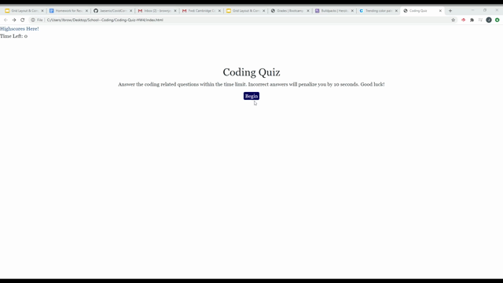

# Coding-Quiz-HW4

Resources used outside of class:

https://www.youtube.com/watch?v=riDzcEQbX6k

https://codereview.stackexchange.com/questions/92817/true-or-false-quiz-logic



# 04 Web APIs: Code Quiz

As you proceed in your career as a web developer, you will probably be asked to complete a coding assessment, which is typically a combination of multiple-choice questions and interactive challenges. Build a timed code quiz with multiple-choice questions. This app will run in the browser and feature dynamically updated HTML and CSS powered by your JavaScript code. It will also feature a clean and polished user interface and be responsive, ensuring that it adapts to multiple screen sizes.

## User Story

```
AS A coding bootcamp student
I WANT to take a timed quiz on JavaScript fundamentals that stores high scores
SO THAT I can gauge my progress compared to my peers
```

## Acceptance Criteria

```
GIVEN I am taking a code quiz
WHEN I click the start button
THEN a timer starts and I am presented with a question
WHEN I answer a question
THEN I am presented with another question
WHEN I answer a question incorrectly
THEN time is subtracted from the clock
WHEN all questions are answered or the timer reaches 0
THEN the game is over
WHEN the game is over
THEN I can save my initials and score
```

### Review

You are required to submit the following for review:

- The URL of the functional, deployed application.

- The URL of the GitHub repository. Give the repository a unique name and include a README describing the project.

---

© 2019 Trilogy Education Services, a 2U, Inc. brand. All Rights Reserved.

Basic functions of files:

1. Outline what files are needed: index.html, highscore.html, quiz.html, style.css, script.js, game.js

2. Create landing page on index.html

3. Link highscore page in header of index.html

4. Link jquery, stylesheet.css, & bootstrap to index.html

5. Create starter for quiz with an event listener, links to quiz.html

6. Format index.html page details to be user-friendly and easy to read

7. Copy index.html to quiz.html

8. Format appropriately, create containers for the questions, choices, and answers.

9. In script.js create variables for the timer & tracking the score

10. Create database variable and fill out questions and answers

11. Make the timer and create if else statement so if the user picks the wrong question it deducts time

12. Create functions so that the game shows the question and answer and allows user to pick answer, store score & create buttons

13. In game.js store the score and calculate it, then make the highscore.html show the score, link back to index.html

14. Style with style.css
